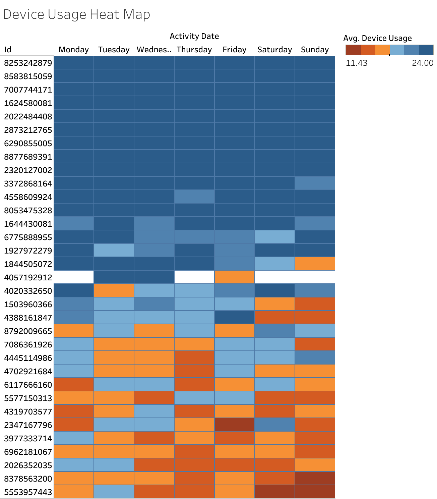

# Hi 👋, I'm Nhi Hoang

### A pasionate Data Analyst

- 📫 How to reach me **nhihoang3396@gmail.com**

<h3 align="left">Connect with me:</h3>
<p align="left">
<a href="https://github.com/nhihoang-data" target="blank"></a>
<a href="https://linkedin.com/in/www.linkedin.com/in/nhi-hoang" target="blank"></a>
</p>

<h3 align="left">Languages and Tools:</h3>
<p align="left"> <a href="https://developer.mozilla.org/en-US/docs/Web/jupyter" target="_blank" rel="noreferrer">  </a> <a href="https://developer.mozilla.org/en-US/docs/Web/numpy" target="_blank" rel="noreferrer">  </a> <a href="https://developer.mozilla.org/en-US/docs/Web/pandas" target="_blank" rel="noreferrer">  </a> <a href="https://developer.mozilla.org/en-US/docs/Web/python" target="_blank" rel="noreferrer">  </a></p>


# Bellabeat-Case-Study-Analysis
Google Data Analytics Capstone: Analyzing FitBit fitness data to provide growth recommendations for Bellabeat.

### Phase 1: Ask

The primary objective is to analyze third-party smart device usage data to identify consumer trends in health and wellness. By understanding how users engage with non-Bellabeat products (like Fitbit), we can map these behaviors onto Bellabeat’s product ecosystem.

The goal is to provide data-driven recommendations that:

- Refine marketing messaging to better resonate with women’s wellness needs.
- Identify underutilized features that Bellabeat can emphasize.
- Unlock new growth opportunities by positioning Bellabeat products as the "smarter" choice for health-conscious women.


### Phase 2: Prepare

Data Source Overview

- Data Location: The primary data source is the FitBit Fitness Tracker Data (public domain), available via Kaggle and originally hosted on Zenodo.
- Data Generation: This data was generated by respondents to a survey via Amazon Mechanical Turk between March 12, 2016, and May 12, 2016.
- Organization: The data is organized in Long Format. Each row represents a specific point in time or a specific day for an individual user, identified by a unique ID.
- Scope: The dataset includes 18 CSV files containing minute-level output for physical activity, heart rate, and sleep monitoring.
- Data limitation: The sample is too small to reflect the population;some users tracked every day, while others only logged data for a few days; only 24 users have sleep data, and only 8 users have weight data. This "thin" data might limit our insights.


### Phase 3: Process

1. Data Integrity & Filtering Logic
   
To ensure the analysis focused on actual user behavior and excluded device downtime (charging or not being worn), the following filters were applied:
- daily_activity_cleaned: Excluded rows where TotalSteps or Calories were 0.
- hourly_steps_cleaned: Excluded rows where StepTotal was 0.
- Rationale: Including 0-step hours (such as during sleep or device charging) would artificially deflate the average activity levels per hour, leading to inaccurate marketing recommendations regarding peak user engagement.
- sleep_day_cleaned: Filtered for TotalMinutesAsleep > 0 to remove invalid logs.

2. Handling Duplicates (Deduplication)
- During the audit of the sleep_day table, 3 unique instances of duplicate logs were identified (users having multiple entries for a single date).
- Action: Used GROUP BY Id, sleep_date and SUM() functions to aggregate multiple sleep sessions into a single daily total per user. This prevented "double-counting" activity data when joining tables.

4. Standardization & Feature Engineering
- Temporal Formatting: Used PARSE_TIMESTAMP and EXTRACT to transform string-based dates into DATE and TIMESTAMP objects.
- Hourly Segmentation: Extracted hour_of_day (0-23) from hourly timestamps. This allows for the identification of high-intensity activity windows.
- Active Minutes Calculation: Created a total_active_minutes metric by summing very, fairly, and lightly active intensities to provide a holistic view of daily movement.


### Phase 4: Analyze

Tools used: BigQuery (SQL) and Tableau.

-- This query creates the summary table for activity and sleep
```sql 
CREATE OR REPLACE TABLE `bellabeat-data-analysis-487517.processed_data.analysis_activity_sleep` AS
SELECT 
    a.Id,
    a.ActivityDate,
    a.TotalSteps,
    a.Calories,
    a.total_active_minutes,
    s.total_minutes_asleep,
    -- New Metric: Sleep Efficiency (%)
    ROUND((s.total_minutes_asleep / s.total_time_in_bed) * 100, 2) AS sleep_efficiency_pct
FROM 
    `bellabeat-data-analysis-487517.processed_data.daily_activity_cleaned` AS a
INNER JOIN 
    `bellabeat-data-analysis-487517.processed_data.sleep_day_cleaned` AS s
    ON a.Id = s.Id AND a.ActivityDate = s.sleep_date;
```

--This query creates the master summary table of each user
```sql
CREATE OR REPLACE TABLE `processed_data.user_master_summary` AS
WITH activity_stats AS (
    SELECT 
        Id,
        MIN(TotalSteps) AS min_steps,
        MAX(TotalSteps) AS max_steps,
        AVG(TotalSteps) AS avg_steps,
        ROUND(STDDEV(TotalSteps), 0) AS step_variability,
        MIN(total_active_minutes) AS min_active_mins,
        MAX(total_active_minutes) AS max_active_mins,
        AVG(total_active_minutes) AS avg_active_mins,
        AVG(Calories) AS avg_calories,
        COUNT(ActivityDate) AS days_tracked,
        -- Calculating Calories per Step (Handling division by zero)
        SAFE_DIVIDE(AVG(Calories), AVG(TotalSteps)) AS calories_per_step
    FROM `processed_data.daily_activity_cleaned`
    GROUP BY Id
),
sleep_stats AS (
    SELECT 
        Id,
        AVG(total_minutes_asleep) AS avg_sleep_mins,
        AVG(total_time_in_bed) AS avg_time_in_bed
    FROM `processed_data.sleep_day_cleaned`
    GROUP BY Id
)
SELECT 
    a.*,
    s.avg_sleep_mins,
    s.avg_time_in_bed,
    -- Segmenting the users based on their Average Steps
    CASE 
        WHEN a.avg_steps < 5000 THEN 'Sedentary'
        WHEN a.avg_steps BETWEEN 5000 AND 9999 THEN 'Lightly Active'
        WHEN a.avg_steps >= 10000 THEN 'Very Active'
    END AS segment_type
FROM activity_stats AS a
LEFT JOIN sleep_stats AS s ON a.Id = s.Id;
```

### Phase 5: Share



Finding 1: The "Weekend Fade" (Inconsistent Engagement)

- Data analysis shows a significant drop-off in device usage and data logging as the week progresses.

- Observation: User participation is less likely to use the device on the weekend.

- Insight: The device is currently integrated into weekday "work-life" routines but is frequently abandoned during leisure time, creating a "weekend data gap."

Finding 2: The "15-Hour Wall" (Partial Daily Usage)

- A substantial portion of the user base is not wearing the device 24/7. A high density of users only records between 11 and 15 hours of wear-time per day.

- Observation: Users are removing the device for 9 to 13 hours every day (likely during sleep or evening hours).

- Insight: There is a missed opportunity for holistic health tracking. If users are not wearing the device overnight, Bellabeat cannot provide accurate sleep or recovery insights, which are core pillars of the brand.

  https://public.tableau.com/app/profile/nhi.hoang7491/viz/AnalysisofActivityandSleep/Sheet3#1

Finding 3: The "Lifestyle User" vs. "The Athlete"

- The vast majority of users do not fit the "Athlete" profile. Activity data is overwhelmingly dominated by Sedentary and Lightly Active minutes.

- Observation: "Very Active" minutes (high-intensity exercise) make up the smallest fraction of total recorded time.

- Insight: Our target audience is the Everyday Woman—someone balancing a busy, often sedentary schedule. Their "activity" comes from daily life (commuting, chores, walking) rather than dedicated gym sessions.

### Phase 6: Act (Recommendations)

Strategy 1: Incentivize Weekend Consistency

- To bridge the "Weekend Fade," Bellabeat should launch "Weekend Wellness" in-app challenges.

- Action: Push notifications on Friday afternoons should encourage users to set a "Leisure Goal," rewarding them for wearing the device through Sunday. This transforms the device from a "work-week tool" into a "lifestyle accessory."

Strategy 2: Focus on "All-Day Comfort" Marketing

- The 11–15 hour wear-time limit suggests users find the device uncomfortable for sleep or home life.

- Action: Marketing campaigns should emphasize the Bellabeat Leaf's versatility (wearing it as a necklace or clip) specifically for evening and sleep comfort. Increasing wear-time to 20+ hours is essential for high-quality data.

Strategy 3: Pivot from "Fitness" to "Wellness"

- Since most users are non-athletes, marketing that focuses on "grind" or "intense workouts" may alienate them.

- Action: Shift the narrative toward Holistic Health. Instead of "Burn More Calories," use messaging like "Move Mindfully." Introduce "Sedentary Nudges" that suggest 2-minute stretching breaks during the workday to help users convert sedentary time into light activity.

